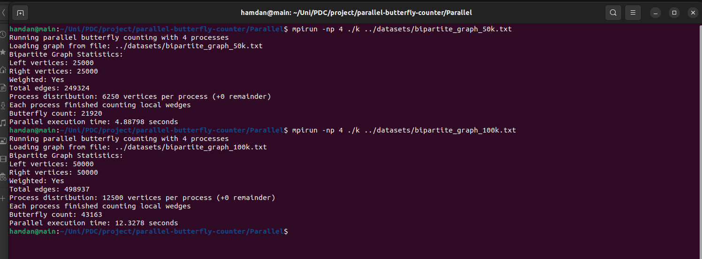

# Parallel Butterfly Counting in Bipartite Graphs

This project implements parallel versions of the butterfly counting algorithm for bipartite graphs using MPI (Message Passing Interface) and METIS for graph partitioning, with an additional hybrid MPI+OpenMP implementation for multi-level parallelism.

## What are Butterflies?

In bipartite graphs, a butterfly is a subgraph pattern consisting of four vertices (two from each partition) connected by four edges, forming a complete bipartite subgraph K₂,₂.

# Parallel Algorithms
## MPI Implementation Details

The MPI implementation follows these key steps:

1. **Graph Loading**: Load the bipartite graph from a file
2. **Graph Partitioning**: Use METIS to partition the graph among available MPI processes
3. **Distributed Wedge Counting**: Each process counts wedges for its assigned vertices
4. **Result Aggregation**: Combine wedge counts from all processes
5. **Butterfly Counting**: Calculate the butterfly count from the aggregated wedge counts

## Hybrid MPI+OpenMP Implementation

The hybrid implementation leverages both distributed and shared memory parallelism:

1. **Distributed Memory (MPI)**: Data is distributed across multiple computing nodes
2. **Shared Memory (OpenMP)**: Multi-threading within each MPI process/node

### Key Features of Hybrid Implementation

- **Two-level Parallelism**:
  - MPI for coarse-grained parallelism (inter-node)
  - OpenMP for fine-grained parallelism (intra-node)
- **Memory Optimization**:
  - Thread-local data structures to reduce contention
  - Batch processing for large datasets to manage memory usage
  - Pre-allocated buffers for efficient communication
- **Load Balancing**:
  - Dynamic scheduling in OpenMP sections
  - Work distribution optimized for heterogeneous workloads

### Compilation and Running

```bash
# Compile the hybrid implementation
mpic++ -fopenmp Parallel/MPI+OpenMP.cpp -o hybrid_butterfly -lmetis

# Run with 4 MPI processes, each using multiple OpenMP threads
export OMP_NUM_THREADS=4  # Set number of OpenMP threads per process
mpirun -np 4 ./hybrid_butterfly path/to/your/dataset.graph
```

## Performance Optimizations

- **METIS Graph Partitioning**: Distributes the graph efficiently among processes
- **Vertex Ranking**: Processes vertices in order of increasing degree
- **Efficient Communication**: Minimizes communication overhead between processes
- **Multi-threading**: Utilizes all cores within each computing node

## Prerequisites

- C++ compiler with C++11 support
- MPI implementation (MPICH or OpenMPI)
- OpenMP support (for hybrid implementation)
- METIS graph partitioning library

## Compilation

```bash
# MPI-only implementation
mpic++ Parallel/MPI.cpp -o mpi_butterfly -lmetis

# Hybrid MPI+OpenMP implementation
mpic++ -fopenmp Parallel/MPI+OpenMP.cpp -o hybrid_butterfly -lmetis
```

## Running the Programs

```bash
# Run MPI implementation
mpirun -np 4 ./mpi_butterfly path/to/your/dataset.graph

# Run hybrid implementation
export OMP_NUM_THREADS=4  # Set OpenMP threads per process
mpirun -np 4 ./hybrid_butterfly path/to/your/dataset.graph
```

## Input File Format

The input file should follow the format:
```
AdjacencyGraph
<num_left_vertices> <num_right_vertices>
<offsets[0]> <offsets[1]> ... <offsets[num_left_vertices]>
<adjacency_list>
```

Or for weighted graphs:
```
WeightedAdjacencyGraph
<num_left_vertices> <num_right_vertices>
<offsets[0]> <offsets[1]> ... <offsets[num_left_vertices]>
<adjacency_list_with_weights>
```

## Performance Analysis

The parallel implementations provide significant speedup over the serial version for large graphs, with scaling proportional to the number of processors used. The exact speedup depends on:

1. Graph size and structure
2. Number of available processes and threads
3. Quality of the graph partitioning
4. Communication overhead
5. Hardware architecture (CPU cores, memory bandwidth)

### When to Use Which Implementation

- **MPI-only**: Best for clusters with limited memory per node but many nodes
- **MPI+OpenMP**: Optimal for modern multi-core systems with significant memory per node
  - Reduces communication overhead
  - Better utilizes shared memory within nodes
  - More efficient for very large graphs

### Communication Overhead Considerations

While the hybrid MPI+OpenMP approach theoretically offers better performance through multi-level parallelism, it can sometimes experience higher communication overhead compared to the pure MPI implementation:

- **Serialization Bottlenecks**: When aggregating results from OpenMP threads before MPI communication
- **Memory Contention**: Multiple threads accessing shared data structures can cause cache invalidation
- **Load Imbalance**: Variations in thread performance within nodes can delay MPI synchronization points
- **Thread Management Overhead**: Creating and managing OpenMP threads adds some computational cost

The implementation includes several optimizations to mitigate these issues:
- Batch processing to reduce memory pressure
- Thread-local data structures to minimize contention
- Pre-allocated communication buffers
- Dynamic scheduling for better load balancing

For optimal performance, the number of MPI processes and OpenMP threads should be carefully tuned based on:
1. The specific hardware architecture
2. The graph size and structure
3. Available memory per node
4. Network communication latency between nodes

For some workloads and hardware configurations, the pure MPI implementation may outperform the hybrid approach due to these overhead factors.

## Comparison with Serial Implementation

For large datasets, the parallel implementations provide significant performance benefits:

- **Reduced execution time**: By distributing the workload across multiple processors
- **Larger graph handling**: Can process larger graphs that may exceed the memory of a single machine
- **Scalability**: Performance improves with additional processors (up to communication overhead limits)

## Testing with Multiple Datasets

It's recommended to test the implementations with various datasets of different sizes and structures to evaluate performance characteristics.

## Performance Comparison
### Serial Implementation


### MPI Implementation


### Hybrid MPI+OpenMP Implementation
